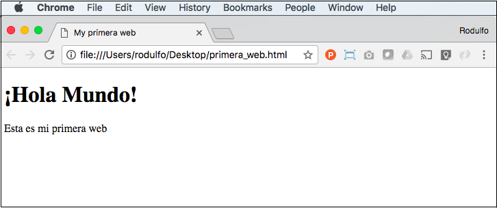

# Tu primer sitio web
## Objetivos
- Entender la función del HTML para crear la estructura básica de una página web
- Conocer los principales elementos y etiquetas HTML
- Aprender a darle dinamismo a una web utilizando JavaScript
- Tener un primer acercamiento al mundo del código, creando tu primera página web

***
_El texto a continuación es una traducción al español, con ciertos ajustes, del capítulo 5 de [JavaScript for kids](http://pepa.holla.cz/wp-content/uploads/2015/11/JavaScript-for-Kids.pdf), Nick Morgan, 2015; y de [Eloquent JavaScript](http://eloquentjavascript.net/), de Marijn Haverbeke, 2014._
***

## HTML: HyperText Markup Language
La consola de JavaScript que hemos utilizando hasta ahora es ideal para probar pequeños fragmentos de código. Sin embargo, para crear programas reales, necesitaremos algo más flexible, como una página web. En esta sección aprenderás cómo crear una página web HTML básica y darle interacción con JavaScript.

HTML (HyperText Markup Language) es el lenguaje utilizado para crear la estructura de una página web. Para crear una web, se empieza creando un documento en formato HTML. Esto es muy parecido a crear un documento con formato word, excel o powerpoint.

Un documento HTML simple se ve así (no te asustes si no entiendes todo lo que dice, te lo explicaremos paso a paso más abajo):

```HTML
<!DOCTYPE html>
<html>
  <head>
    <title>Mi primera web</title>
  </head>
  <body>
    <h1>¡Hola Mundo!</h1>
    <p>Esta es mi primera web</p>    
  </body>
</html>

```
Al abrir este mismo documento HTML en un navegador (como Chrome), se ve lo siguiente:



El navegador "lee" el archivo HTML (el texto y las etiquetas que están adentro) y las presenta según las reglas del lenguaje. Por ejemplo, los textos que están dentro de las etiquetas `<h1> </h1>` son considerados encabezados o titulares, mientras que los textos dentro de las etiquetas `<p> </p>` son considerados párrafos. Por eso, el texto _¡Hola Mundo!_ se visualiza mucho más grande que el texto _Esta es mi primera web._

## Crea tu primera web
Como ya lo dijimos, _**la mejor manera de aprender es haciendo**_. Por eso, es hora de que tú misma crees una web y aprendas HTML.

En el siguiente video, Michelle te guiará a través de los siguientes pasos para que crees tu primera web:

  1. Descarga Atom, un editor de texto: https://atom.io/
  2. Crea un documento HTML llamado `mi-pagina.html`
  3. Agrega algunos elementos al documento HTML (por ejemplo: un título y un párrafo)
  4. Guarda el documento HTML
  5. Abre el documento HTML en un navegador como Chrome

Aquí el video de Michelle:

[](https://www.youtube.com/watch?v=TePHiOKb72k)

## Etiquetas y elementos HTML
Como te ha explicado Michelle, los documentos HTML se componen de `elementos`. Salvo algunas excepciones (por ejemplo `<!DOCTYPE html>`), los elemento comienza con una `etiqueta de inicio` y termina con una `etiqueta de fin`. Por ejemplo, en nuestro documento tenemos el elemento `p`, que comienza con la etiqueta de inicio `<p>` y termina con la etiqueta de finalización `</p>`. El texto que se encuentra entre las etiquetas de apertura y de cierre es el _contenido_ del elemento.

> El elemento `p` como ejemplo:


Hagamos un recorrido por todos los elementos de nuestro documento:

1. El documento empieza con la etiqueta `<!DOCTYPE html>` (que como vimos, no tiene inicio o cierre). Su función es hacerle saber al navegador que interprete el documento como HTML _moderno_, en contraposición a varios dialectos que estaban en uso en el pasado.

2. Luego viene la etiqueta de apertura `<html>` (la etiqueta de cierre `</ html>` está al final). Por estándar, todos los documentos HTML deben tener un elemento `html` que "englobe" todo lo demás.

3. Dentro del elemento `html` hay dos elementos: el `head` (cabeza en Español) y el `body` (cuerpo en Español). El `head` contiene información _sobre_ el documento, y el `body` contiene el documento en sí.

4. Dentro del elemento `head` está el elemento `title` (con su etiqueta de inicio y de cierre), que contiene el título del documento. Es por eso que al visualizar el archivo en el navegador, el título en la pestaña del navegador dice: "Mi primera web". Es importante que notemos que el elemento `title` está _contenido_ dentro del elemento `head`; el cual, a su vez, está _contenido_ dentro del elemento `html`.

5. Finalmente, tenemos el elemento `body` (entre su etiqueta de inicio y de cierre) que _contiene_ el contenido que se mostrará en el navegador. En este caso, dentro del body tenemos dos elementos adicionales: el `h1` y el `p`.

<!--

Una manera de visualizar este concepto de "encapsulado" donde unos elementos "contienen" a otros es a través de este gráfico:


-->

Existen muchos más elementos y etiquetas HTML, que aprenderás en su momento. Por el momento, es hora de regresar a JavaScript.

<!-- ## HTML + CSS
Agrega estilos con CSS
-->

## HTML y JavaScript
Es importante que entiendas que HTML _**no**_ es un `lenguaje de programación`; es un `lenguaje de marcado de texto`. Como hemos visto, con HTML le damos una estructura a nuestra páginas y es digamos el "formato" que utilizan los navegadores para presentar el contenido de una web.

Sin embargo, si queremos darle _comportamiento_ o interacción a nuestra web, necesitamos usar un lenguaje de programación. Y el **único** (?) `lenguaje de programación` para correr en los navegadores web es JavaScript. Dicho en otras palabras, con JavaScript es que logramos que las web puedan responder a acciones de usuario, ....

Existen dos maneras de incluir JavaScript con HTML
1. script
2. link a otro file

## Añádele interacción a tu web
En el siguiente video, Michelle te guiará a través de los siguientes pasos para que le agregues interacción a tu web:

  1. ...
  2. Agrega interactividad con JS usando `alert()`, `document.write()` y `prompt()`
  3. ...

Aquí el video de Michelle:

[](https://www.youtube.com/watch?v=TePHiOKb72k)

<!--
## Sube tu página a GitHub Pages
y deplegándola en [GitHub Pages](https://pages.github.com/)
-->

**[Continuar](04-prueba-tu-conocimiento-introduction.md)**
