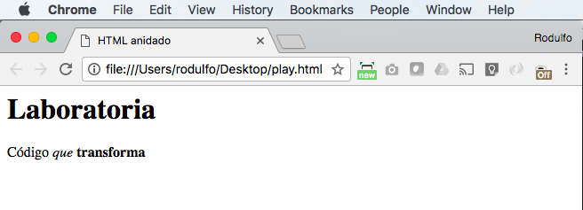
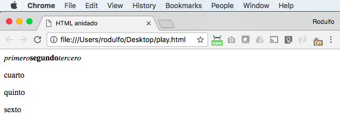
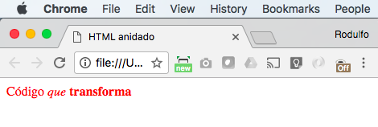

# HTML

- Tipo: `lectura`
- Formato: `self-paced`
- Duración: `60min`

## Objetivos de Aprendizaje

- Conocer los elementos HTML más comunes
- Entender el concepto de anidamiento HTML
- Conocer las diferencias en el comportamiento bloque y en línea de elementos
HTML
- Conocer qué son y para qué sirven los atributos de elementos HTML

## ¿Qué es HTML?

En el curso de `Introducción a la Programación` creaste tu primer website.
Aprendiste a crear un archivo HTML y a vincularlo con tu archivo JavaScript.
En esta lección profundizaremos más en HTML.

Revisando directamente la documentación del [Mozzilla Developer Network](https://developer.mozilla.org/es/docs/Learn/HTML/Introduccion_a_HTML/iniciar)
tenemos lo siguiente:

> HTML (HyperText Markup Language) no es un lenguaje de programación, es un
lenguaje de marcado, usado para decirle a tu navegador cómo estructurar las
páginas que visitas. Puede ser tan complejo o tan simple como desee el
desarollador web.
>
> HTML consiste en una serie de elementos, que puedes utilizar para encerrar,
envolver, o marcar partes diferentes del contenido para hacer que aparezcan de
una cierta manera, o actuen de determinada forma. Las etiquetas que envuelven
un trozo de contenido pueden hacer que dicho contenido enlace con otra página,
ponga una palabra en cursiva, etcétera.

## Anatomía de un elemento HTML

Recordemos que salvo algunas excepciones (por ejemplo `<!DOCTYPE html>`), los
elementos html comienzan con una `etiqueta de apertura (o inicio)` y terminan
con una `etiqueta de cierre (o fin)`. Por ejemplo, el elemento `p` comienza
con la etiqueta de inicio `<p>` y termina con la etiqueta de cierre `</p>`. El
texto que se encuentra entre las etiquetas de apertura y de cierre es el
 _contenido_ del elemento.


## Anidamiento HTML

Un elemento puede contener en su contenido otros elementos o etiquetas HTML.
Esto se llama _anidamiento_.

Recordemos la estructura básica de un documento html que hemos venido usando
en la mayoría de nuestros ejercicios y agreguemos un par de elementos
adicionales:

```html
<!DOCTYPE html>
<html>
  <head>
    <title>HTML anidado</title>
  </head>
  <body>
    <h1>Laboratoria</h1>
    <p>Código <em>que</em> <strong>transforma</strong></p>
  </body>
</html>
```

Fíjate cómo ciertos elementos "anidan" otros. Es decir, algunos
elementos están "contenidos" dentro de otros. Por ejemplo, el elemento `body`
tiene dos elementos anidados (o hijos) que son el título `h1` y el
párrafo `p`. A su vez, el párrafo `p` contiene dos elementos adicionales
(otros hijos): `em` y `strong`.

Podemos visualizar este concepto de _anidamiento_ html de la siguiente manera:


En este ejemplo vemos elementos que ya deberían ser familiares para ti. Ya
conoces sobre la etiqueta `DOCTYPE`, los elementos `head`, `body`, `title`,
`h1` y `p` (si necesitas un repaso de esto, te sugerimos leer de nuevo la
lección de [crea tu primer website](https://github.com/Laboratoria/curricula-js/blob/master/01-intro/01-introduction/03-your-first-website.md) del curso `Introducción a la Programación`). Un par de elementos
adicionales que hemos añandido son: `em` que hace que su
contenido se visualice como texto en _cursiva_ y `strong` que hace que su
contenido se visualice como texto en _negrita_.

Al abrir este documento en el navegador tendremos lo siguiente:



## Elementos bloque vs. en línea

Regresemos a la lectura de HTML del [Mozzilla Developer Network](https://developer.mozilla.org/es/docs/Learn/HTML/Introduccion_a_HTML/iniciar).
Nos dice:

> Existen dos importantes categorías de elementos en HTML: elementos a nivel de
bloque y elementos en línea.
>
> * Los elementos a nivel de bloque forman un bloque visible en una página —
aparecerán en una nueva línea de cualquier contenido que haya venido antes,
y cualquier contenido que venga después también aparecerá en una nueva línea.
Los elementos a nivel de bloque tienden a ser elementos estructurales en la
página que representan por ejemplo párrafos, listas, menús de navegación,
pies de página, etc. Un elemento a nivel de bloque no estaría anidado dentro
de un elemento en en línea, pero podría estar anidado dentro de otro elemento
a nivel de bloque.
>
> * Los elementos en línea son aquellos que están contenidos dentro de
elementos a nivel de bloque y rodean solo pequeñas partes del contenido
del documento, no párrafos enteros ni agrupaciones de contenido. Un elemento
en línea  no causará que una nueva línea aparezca en el documento:
normalmente aparecen dentro de un párrefo o texto, por ejemplo elementos de
énfasis como `em` o `strong`.

Veamos un ejemplo:

```html
<!DOCTYPE html>
<html>
  <head>
    <title>HTML anidado</title>
  </head>
  <body>
    <em>primero</em><strong>segundo</strong><em>tercero</em>
    <p>cuarto</p><p>quinto</p><p>sexto</p>
  </body>
</html>
```

Al visualizar el documento anterior en el navegador tendremos:



Tanto `em` como `strong` son elementos en línea. Por lo tanto, los tres
primeros elementos se sitúan en la misma línea uno tras otros sin espacio
entre ellos. Por otro lado, `p` es un elemento a nivel de bloque, así que
cada elemento aparece en una nueva línea, con espacio sobre y debajo de
cada `p`.

## Elementos HTML

Tienes a tu disposición múltiples elementos HTML para construir productos en
la web. Investiga por tu cuenta (utilizando tu gran aliado Google) y aprende
cómo agregar lo siguiente a una web:

1. Encabezados para títulos y subtítulos (tip: headings)
2. Un link
3. Una tabla
4. Una lista
5. Una imagen
6. Una línea divisoria (tip: horizontal rule)
7. Una cita
8. Resaltar un texto (tip: mark)

Para cada elemento anterior entiende si se comporta como `inline` o como
`block`.

## Atributos

En tu investigación seguro te topaste con [el elemento `a` para agregar un link a tu web:](https://developer.mozilla.org/es/docs/Web/HTML/Elemento/a) y habrás
notado que en la etiqueta de apertura aparece una serie de información:

```html
<a href="http://laboratoria.la/" target="_blank" title="Página de inicio de Laboratoria">Ir a Laboratoria</a>
```

Esa información son **atributos**. Los atributos nos dan información adicional
sobre el contenido de un elemento la cual no queremos que aparezca en el
contenido actual. En algunos casos agregan características
y/o comportamiento a tu elemento HTML. Los atributos aparencen en la
**etiqueta de apertura** del elemento y consisten de dos partes: un nombre
y un valor, separados por un signo de igual (`=`).

En el caso del ejemplo anterior, podemos visualizar tres
atributos: el atributo `href`, el atributo `target` y el atributo `title`.

* El atributo `href` especifica la dirección web que quieres que el enlace
apuente; es decir, donde el navegador navega cuando se le hace clic. En este
ejemplo vemos que apunta a la página de inicio de laboratoria:
http://laboratoria.la/

* El atributo `target` especifica el contexto de navegación que será usado
para mostrar el enlace. Por ejemplo, `target="_blank"` mostrará el enlace en
una nueva pestaña. Si quieres mostrar el enlace en la pestaña actual solo
omite este atributo.

* El atributo `title` especifica información extra sobre el enlace, como qué
página es la que estás enlazando. En nuestro ejemplo dice "Página de inicio
de Laboratoria". Esto aparecera como información cuando se pase el ratón
por encima del link.

Existen muchos atributos comunes a todos los elementos html y existen atributos
específicos que son asociados a un elemento en particular. Un atributo que
aplica a casi todos los elementos html es el atributo `style` lo cual
permite darle estilos a tu elemento. Por ejemplo, si queremos que el contenido
dentro de un elemento `p` sea de color rojo, hacemos:

```html
  <p style="color: red">Código <em>que</em> <strong>transforma</strong></p>
```

Al visualizar el documento anterior en el navegador tendremos:




En la próxima lección sobre `css` profundizaremos en el concepto de darle
estilos a tus elementos html.

## Etiquetas vacías

En tu investigación seguro también te topaste con [el elemento `` para agregar una imagen a tu web](https://developer.mozilla.org/es/docs/Web/HTML/Elemento/img) y habrás
notado que no tiene una etiqueta de cierre y, por lo tanto, no tiene "contenido":

```html

```

Algunas etiquetas no tienen directamente contenido; más bien reciben una _fuente_
de la cual obtener el contenido. Esto es lo que sucede con
el elemento `img`. El atributo `src` brinda la ruta del contenido. En este caso,
al ir a la ruta http://cde.2.trome.pe/ima/0/1/1/8/5/1185397.jpg encontraremos
la foto de Mariana con Mark y Barack :)


Otro elemento que no tiene etiqueta de cierre es `br`. [Lee la documentación
de MDN sobre `br`](https://developer.mozilla.org/es/docs/Web/HTML/Elemento/br).
¿Para qué sirve `br`?

## Comentarios en HTML

Así como podemos comentar nuestro código `javascript` para hacerlo más
entendible, también podemos agregar comentarios a nuestro código `html`.
Para definir un comentario en un archivo html, usamos las etiquetas `<!--` para
arbrir el comentario y `-->` para cerrarlo.

```html
    <!-- Esto es un comentario. No se verá en la web, pero sí en mi código. -->
```

## Replicando la página de Grace Hopper de wikipedia

Ahora que tienes una idea de los elementos `html` más comunes, su
comportamiento (inline vs block) y sus atributos principales, Michelle te
explicará cómo construir una réplica de la página de [Grace Hopper de wikipedia](https://en.wikipedia.org/wiki/Grace_Hopper):

[](https://www.youtube.com/watch?v=-hLSzYr3z44)
***

[Continuar](03-css.md)
