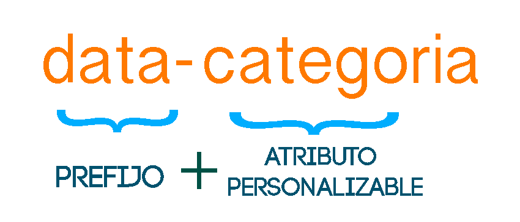
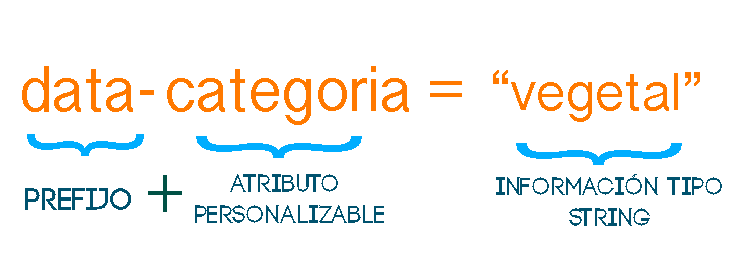

# Data Attributes
   
* Tipo: lectura
* Formato: self-paced
* Duración: 4h

## Objetivos de Aprendizaje

* Entender que son los Data Attributes
* Sintaxis de los Data Attributes
* Saber cuando se utiliza un los Data Attributes

## ¿Qué son los Data Attributes?

Son una de las nuevas caracteristicas de HTML5, los Data Attributes nos permiten asociar a un o unos elemntos en particular fragmentos de información sobre la semantica de html.

## Sintaxis de los Data Attributes

Una nueva ventaja de los data attributes es que son personalizables. Tal vez ahorita no entiendas mucho pero primero entendamos la sintaxis para despues poder ver un ejemplo y que nos quede mas claro.

Se usa un prefijo data- más el nombre del atributo que nosotros querramos.

A parte del prefijo data- la sintaxis válida debería contener sólo letras, guiones(-), puntos(.), dos puntos (:), o guión bajo (_) y *NO* debería tener mayúsculas.

Luego de tener nuestro prefijo y atributo definido es igual que como hemos visto se ponen atributos a un elemento: 

Hay dos cosas que se debe mantener en cuenta:
 * La información guardada en estos data attribute deberá ser de tipo string.
 * Solo se debe usar cuando no haya otros elementos apropiados. Un elemento no apropiado sería data-class, puedes usar números  pero estos aparecerán en string y después convertirlos en js.

----

Ahora que sabemos su significado y como es su sintaxis, entendamos bien que es un Data Attribute y para que sirve

Alguna vez has usado clases para guardar información con el proposito de que tu JavaScript sea más simple? Si si te tengo una noticia justo para eso HTML5 agrego los data attributes,pero a lo mejor esto no te dice mucho que te parece si lo vemos con un ejemplo de que podamos aplicar en la vida real?

Supongamos que queremos una lista de semillas vegetales para plantar, si queriamos hacer nuestro js mas sencillo poniamos una clase de cuanto iba a crecer

    <ul id="semillas-vegetales">
      <li class="altura10">Carrots</li>
      <li class="altura30">Celery</li>
      <li class="altura3">Radishes</li>
    </ul>
    
pero esto no tiene mucho sentido ya que las clases se usan para poder modificar los estilos y me llenaria de clases si por ejemplo a esto quisera yo agregarle el tiempo de cosecha. Pero como ya sabemos ahora existen los Data Attributes

   <li data-spacing="10cm" data-sowing-time="March to June">Carrots</li>
  <li data-spacing="30cm" data-sowing-time="February to March">Celery</li>
  <li data-spacing="3cm" data-sowing-time="March to September">Radishes</li>
</ul>